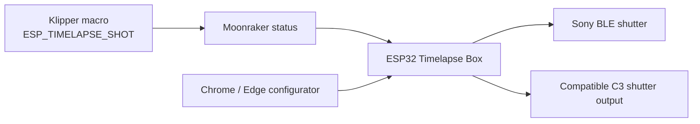

# ESP32 Timelapse Box

**ESP32 延时摄影盒子** connects Klipper layer events to a camera shutter without keeping a PC listener running. The project includes ESP32-S3 Sony BLE firmware, a compatible ESP32-C3 MicroPython route, dual-name Klipper macros, and a bilingual browser configurator.

ESP32 延时摄影盒子把 Klipper 的层事件直接转换为相机快门动作，不依赖电脑端常驻监听。仓库包含 ESP32-S3 Sony BLE 固件、兼容型 ESP32-C3 MicroPython 路线、双名称 Klipper 宏和中英双语浏览器配置器。

> v0.1.0 is an engineering prerelease. Always complete dry-run before enabling real shutter triggering.

Download the ready-to-use assets from the GitHub release, or read the [v0.1.0 release notes](docs/release-v0.1.0.md). Source changes are tracked in [CHANGELOG.md](CHANGELOG.md).

For the complete end-to-end setup, including the ESP32-S3, Klipper macro,
Moonraker, experimental SnapOrca, Sony pairing, safe first print, recovery, and
multi-brand community testing, read the **[Complete System Guide](docs/complete-system-guide.md)**.
中文用户请阅读 **[ESP32 延时摄影盒子完整教程](docs/complete-system-guide.zh-CN.md)**。

An optional [multi-brand BLE community probe](docs/multibrand-community-testing.md)
is available separately for Canon, Fujifilm, Nikon, and Ricoh protocol testing.
It is a manual hardware-validation Alpha, not a supported timelapse route. 中文请读
[多品牌社区测试教程](docs/multibrand-community-testing.zh-CN.md)。

## How It Works

| Route | Board runtime | Camera path | Setup |
| --- | --- | --- | --- |
| ESP32-S3 + Sony BLE | ESP-IDF / Bluedroid | First pairing and active reconnect to a compatible Sony camera | Serial commands in the browser configurator |
| Compatible ESP32-C3 | MicroPython | Existing shutter-box GPIO/HID behavior | Browser raw REPL upload; HTTP polling or WebSocket agent |

The compatible ESP32-C3 route preserves the earlier shutter-box protocol. See [compatibility and legacy aliases](docs/compatibility.md) for exact old-to-new mappings.

## Start Here

1. Install [the Klipper macro](config/klipper/esp32_timelapse.cfg).
2. Choose a hardware guide:
   - [ESP32-S3 + Sony BLE quick start](docs/quickstart-esp32-s3-sony-ble.md)
   - [Compatible ESP32-C3 quick start](docs/quickstart-compatible-esp32-c3.md)
3. Launch the configurator with `START-WINDOWS.cmd` or `START-MAC.command`.
4. On first S3 use, pair Sony from the browser while the camera shows its Bluetooth remote pairing screen. Later boots safely reconnect the saved camera without taking a photo.
5. Keep the box in dry-run until a real short print produces at least one expected layer event without taking a photo.
6. Arm only after the camera is ready and framing has been checked.

中文入口：先安装 [Klipper 宏](config/klipper/esp32_timelapse.cfg)，再按所用硬件打开对应快速入门。浏览器连接串口时只读取状态，不会改变当前 dry-run/armed；需要停拍时使用页面上的显式锁定按钮。

## Timelapse Modes

- **Off:** no timelapse command is emitted.
- **Traditional:** wait for current motion, send one shot command after the completed layer, then wait for camera timing.
- **Smooth:** build a real stabilization tower, finish the layer and tower work, park safely, take one frame, and return at clearance height.

The maintained experimental SnapOrca build is available from the
[U1 Experimental 2.3.5 alpha.1 release](https://github.com/MOVIBALE/OrcaSlicer/releases/tag/u1-experimental-2.3.5-alpha.1).
Developers maintaining another source tree can use the
[SnapOrca migration prompt](docs/snaporca/esp32-timelapse-box-migration-prompt.md).

## Safety Contract

- Canonical macro: `ESP_TIMELAPSE_SHOT`.
- Every macro call advances one shared event sequence.
- S3 boots unarmed and may safely reconnect a bonded Sony without writing FF01; opening the browser only reads status and never silently changes dry-run/armed.
- S3 first pairing uses `q`, forces dry-run, and performs no Sony FF01 shutter write.
- Armed mode requires a verified dry-run event, exact confirmation phrase, and `ready=true` for the Sony route.
- The diagnostic report redacts Wi-Fi credentials, SSID, private IPv4 addresses, and device addresses.
- No bundled configuration contains a real password, printer IP, COM port, or camera address.

## Validation

An anonymized U1 test print completed **135 / 135** expected layer frames with the Sony BLE route. Automated coverage includes canonical and legacy macro selection, C3 method deduplication, safe S3 serial provisioning, dual browser workflows, Smooth tower ordering, privacy redaction, and release package scanning. See [validation evidence](docs/validation.md).

## Repository Layout

- `firmware/esp32-s3-sony-ble-timelapse/`: ESP32-S3 firmware source and build configuration.
- `firmware/esp32-s3-multibrand-nimble-experimental/`: optional manual BLE hardware probe; no Klipper automation.
- `device_files/`: compatible C3 MicroPython listener and WebSocket agent.
- `config/klipper/`: canonical macro plus legacy alias.
- `apps/klipper-timelapse-configurator/`: static bilingual Web Serial configurator.
- `tools/`: canonical C3 filesystem utility and deprecated compatibility wrapper.
- `docs/`: setup, protocol, migration, validation, troubleshooting, and SnapOrca handoff.

## Project Status

This is an independent open-source project and is not affiliated with, endorsed by, or supported by any printer or camera manufacturer. Product names in compatibility documentation identify interoperability targets only.

Licensed under the GNU General Public License v3.0 only (`GPL-3.0-only`). Distributed modified versions must remain under GPLv3 and provide the corresponding source. Contributions should follow [CONTRIBUTING.md](CONTRIBUTING.md); security-sensitive reports should follow [SECURITY.md](SECURITY.md).
